# 📚 AWS DevOps Book Management Platform

A production-grade Three-Tier Web Application deployed on AWS using modern DevOps practices, Infrastructure Design principles, CI/CD automation, monitoring, and secure networking.

This project demonstrates the deployment of a scalable React and Node.js application using AWS services such as VPC, Auto Scaling Groups, Application Load Balancers, Amazon RDS, Route 53, CloudWatch, CodePipeline, CodeBuild, and Systems Manager.

---

# 🚀 Live Application

🌐 Domain: http://project.riyaa.xyz

---

# 📖 Project Overview

The Book Management Platform is a full-stack web application that enables users to manage books and authors through a responsive web interface.

The solution follows a Three-Tier Architecture:

### Presentation Layer
- React.js
- Nginx
- Auto Scaling Group
- Internet-facing Application Load Balancer

### Application Layer
- Node.js
- Express.js
- PM2 Process Manager
- Internal Application Load Balancer
- Auto Scaling Group

### Data Layer
- Amazon RDS MySQL

---

# 🏗️ Solution Architecture

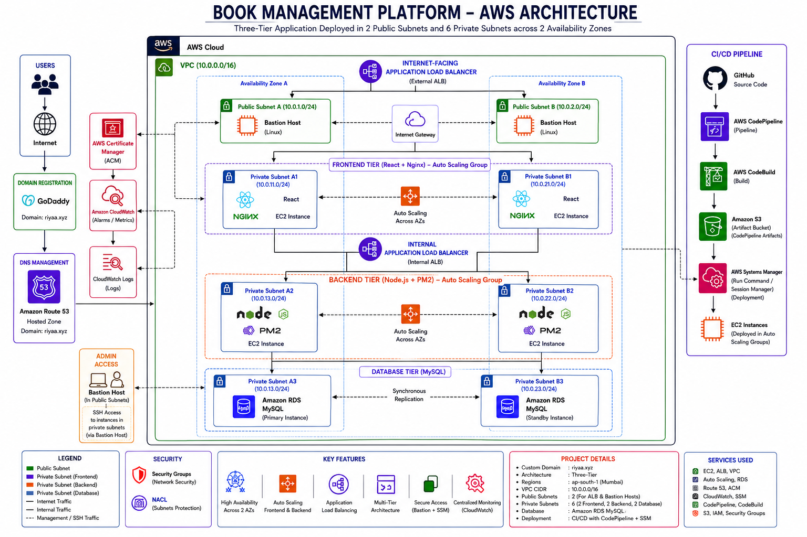

## Architecture Highlights

- Multi-AZ Deployment
- Custom VPC Architecture
- Public and Private Subnet Segmentation
- Auto Scaling Groups
- Application Load Balancers
- Amazon RDS MySQL
- Route 53 DNS Management
- CI/CD Automation
- Centralized Monitoring and Logging
- Secure Access using AWS Systems Manager

---

# ☁️ AWS Services Used

| Category | AWS Services |
|-----------|--------------|
| Compute | Amazon EC2, Auto Scaling |
| Networking | VPC, Route 53, Application Load Balancer |
| Database | Amazon RDS MySQL |
| Monitoring | CloudWatch Logs, CloudWatch Alarms |
| Security | Security Groups, IAM, ACM |
| Deployment | CodePipeline, CodeBuild, Systems Manager |
| Storage | Amazon S3 |
| DNS | Route 53 |
| Access Management | AWS Systems Manager |

---

# 🌐 Network Architecture

The application is deployed inside a custom VPC spanning multiple Availability Zones.

### Public Subnets
- Bastion Host Access
- Internet-facing Load Balancer

### Private Subnets
- Frontend Tier (React + Nginx)
- Backend Tier (Node.js + PM2)
- Database Tier (Amazon RDS MySQL)

This design ensures that backend services and databases remain inaccessible from the public internet.

---

# 🔄 CI/CD Pipeline

The deployment process is fully automated.

```text
GitHub
   ↓
AWS CodePipeline
   ↓
AWS CodeBuild
   ↓
Amazon S3 Artifact Store
   ↓
AWS Systems Manager
   ↓
EC2 Auto Scaling Groups
```

### Pipeline Features

- Automated Source Integration
- Continuous Build Validation
- Artifact Management
- Automated Deployment
- Centralized Deployment Management

---

# 📊 Monitoring & Logging

CloudWatch has been integrated for operational visibility.

### Monitoring

- Application Health Monitoring
- Infrastructure Metrics
- Load Balancer Metrics
- EC2 Performance Metrics

### Logging

- Application Logs
- Deployment Logs
- Systems Manager Logs

---

# 🔐 Security Implementation

Security best practices have been incorporated throughout the architecture.

### Security Controls

- Private Application Layer
- Private Database Layer
- Security Groups
- Network Segmentation
- IAM Roles
- SSL/TLS Certificate Management
- Route 53 DNS Management
- Systems Manager Secure Access

---

# 📸 Infrastructure Screenshots

## VPC

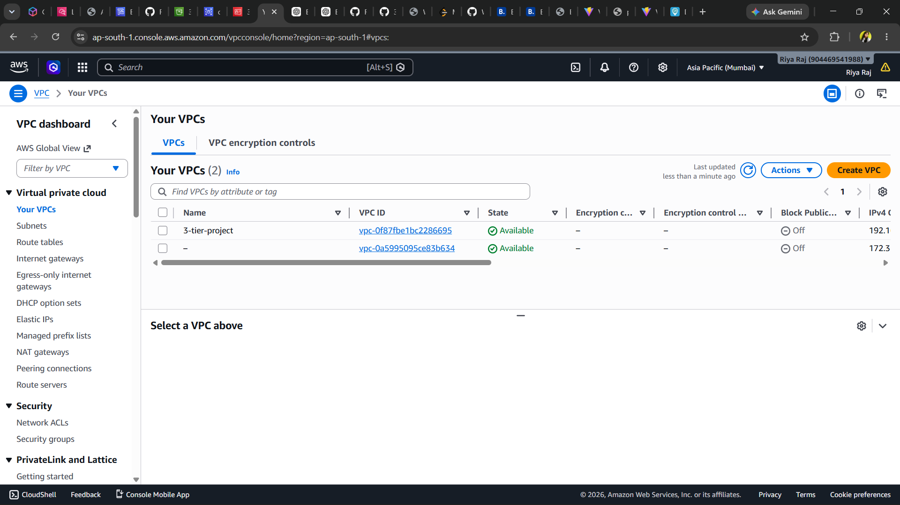

## Subnet Design

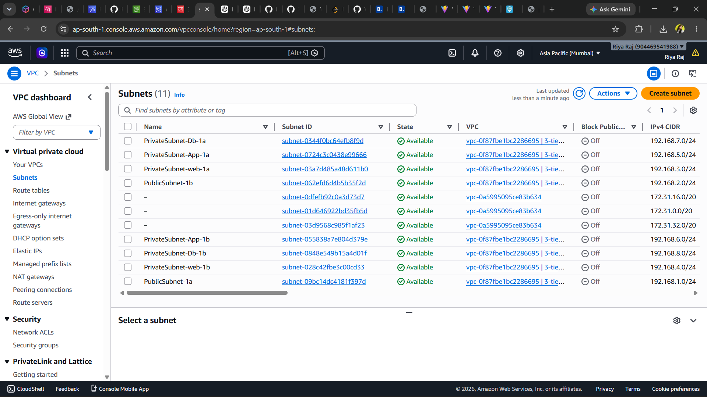

## EC2 Instances

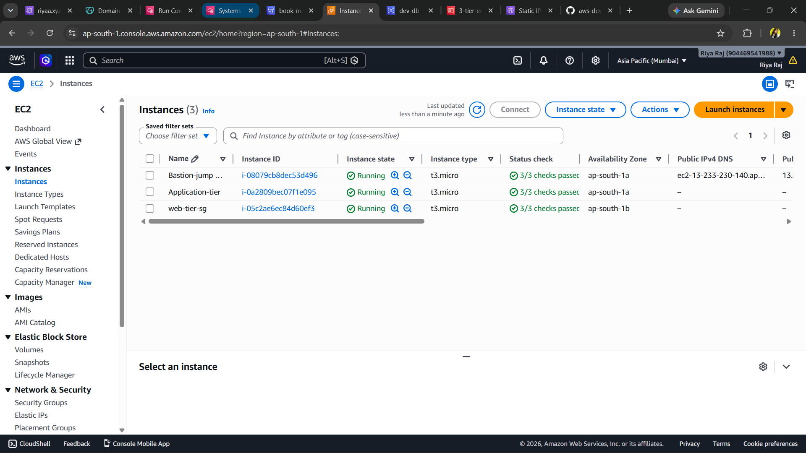

## Application Load Balancer

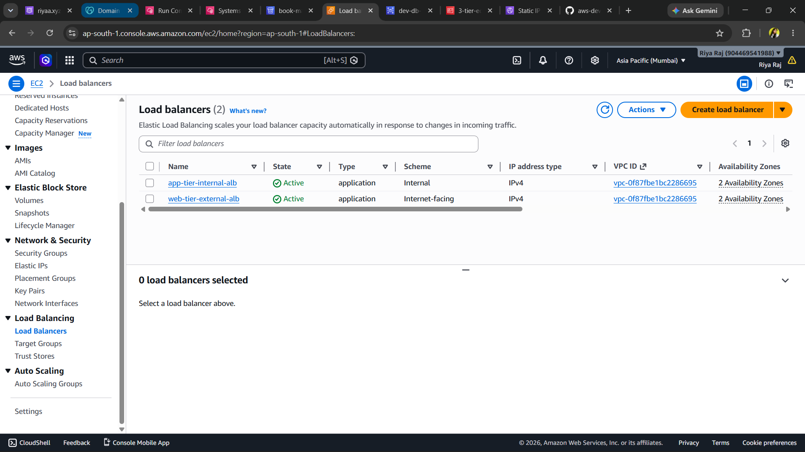

## Route 53

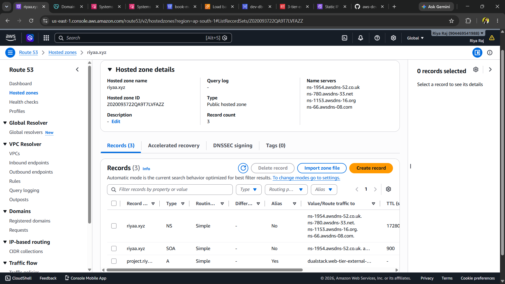

## Amazon RDS

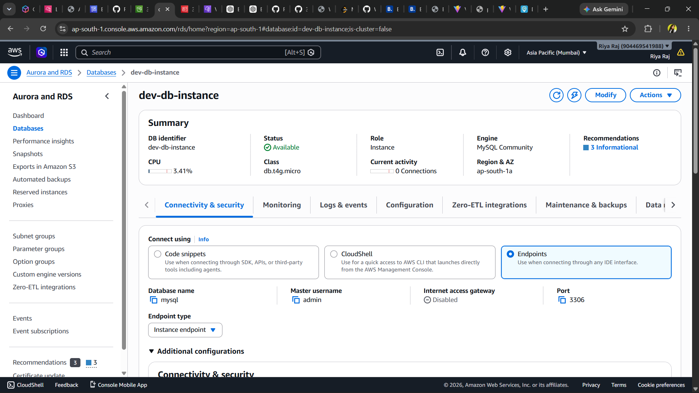

## AWS Systems Manager

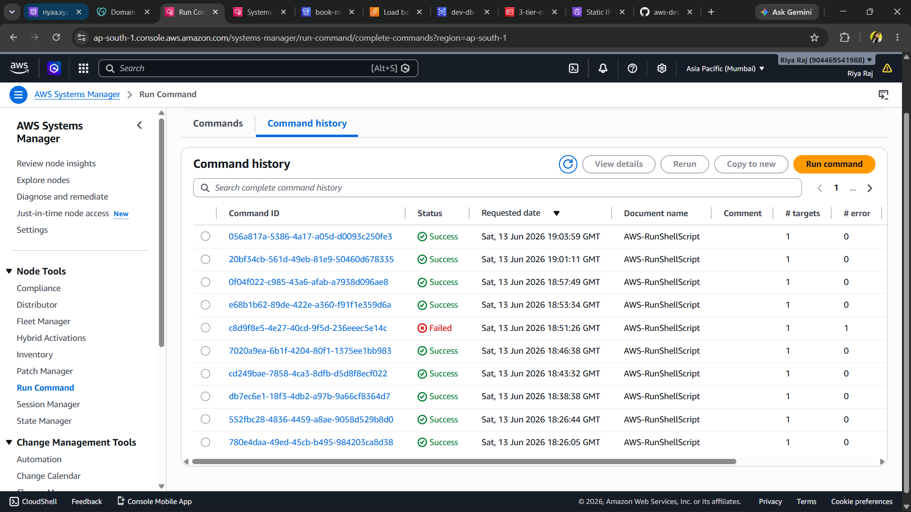

## Managed Nodes

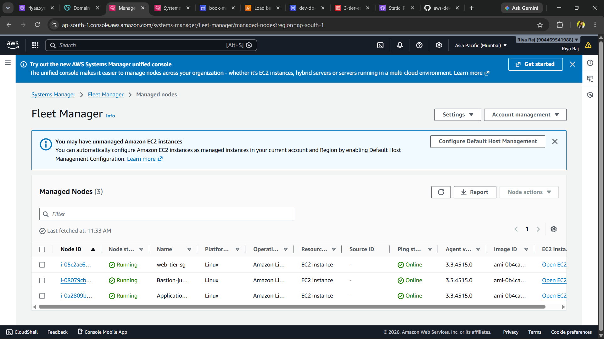

## Parameter Store

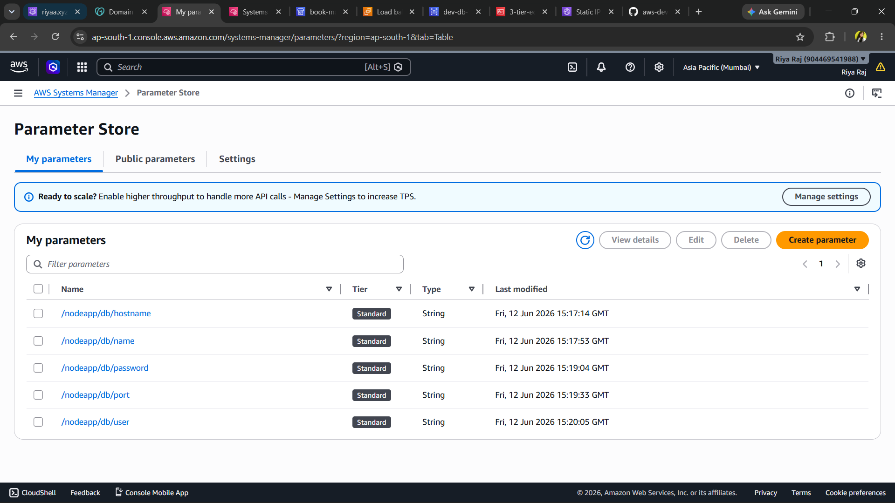

## CloudWatch Logs

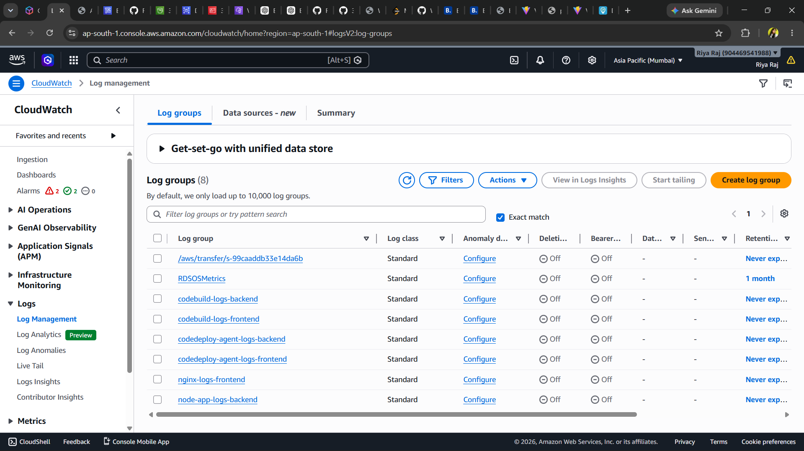

---

# 📸 CI/CD Screenshots

## CodePipeline

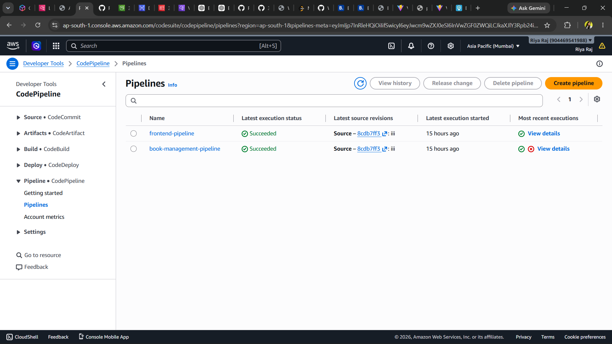

## Backend Deployment Pipeline

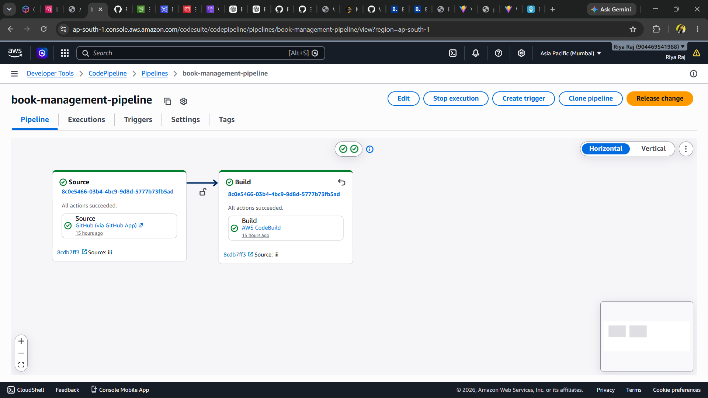

## CodeBuild

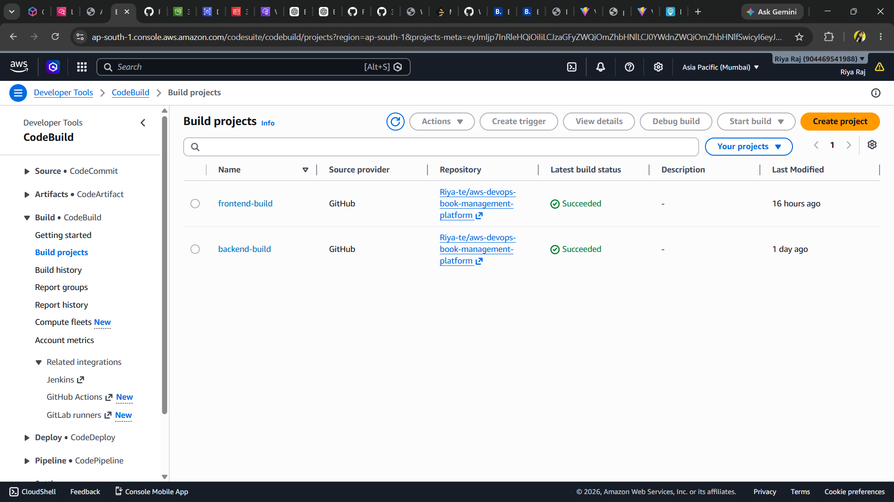

## S3 Artifact Bucket

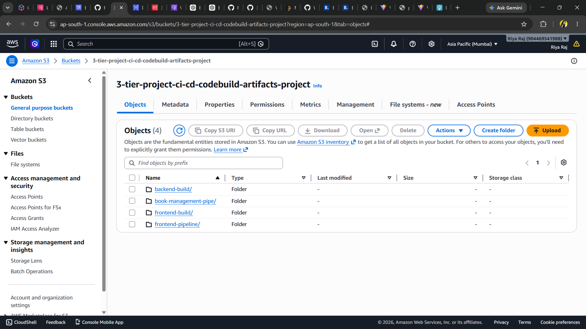

---

# 📸 Application Screenshots

## Dashboard

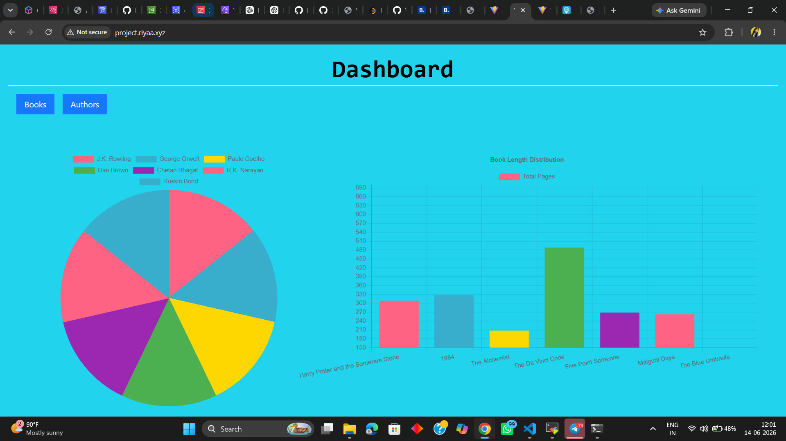

## Authors Management

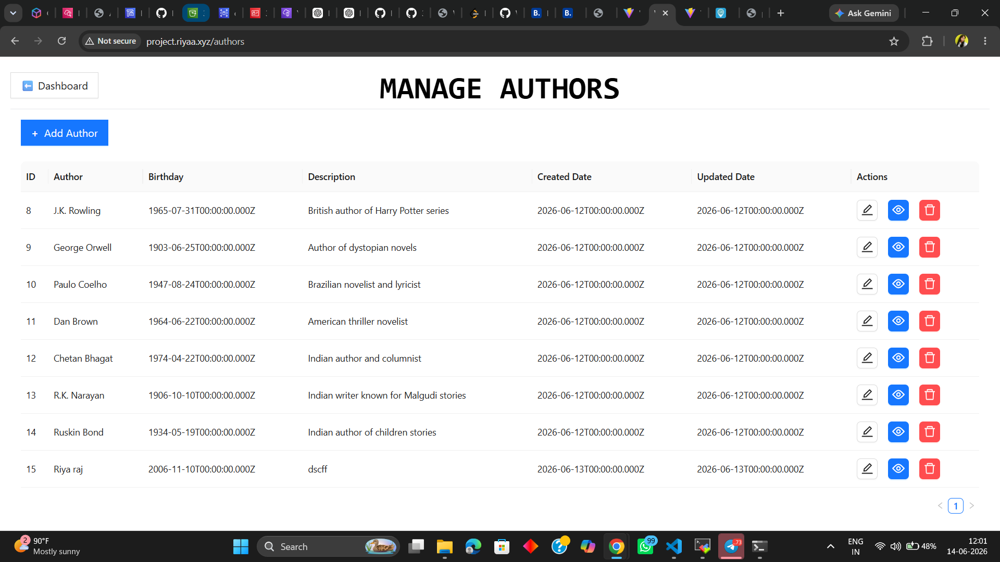

---

# 🎯 Key DevOps Concepts Demonstrated

✅ Three-Tier Architecture

✅ Infrastructure Design

✅ High Availability

✅ Auto Scaling

✅ Load Balancing

✅ Continuous Integration

✅ Continuous Deployment

✅ Systems Manager Deployment

✅ Cloud Monitoring

✅ DNS Management

✅ Infrastructure Security

✅ Multi-AZ Architecture

---

# 📈 Business Benefits

- High Availability
- Fault Tolerance
- Scalability
- Automated Deployments
- Reduced Operational Overhead
- Improved Security
- Centralized Monitoring
- Production-Ready Architecture

---

# 👩‍💻 Author

### Riya Raj

AWS Cloud & DevOps Engineer

GitHub: https://github.com/Riya-te

LinkedIn: <Add LinkedIn URL>

---

## ⭐ If you found this project useful, please consider giving it a star.
